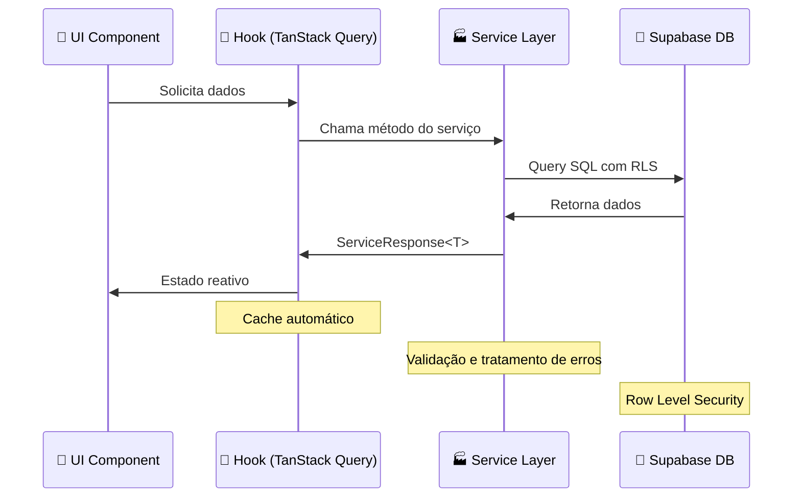

# 🧠 Mind Lattice Pro

> **Sistema profissional de gestão terapêutica baseado no modelo EEMM (Evolução, Emoção, Motivação e Memória)**

Uma aplicação moderna e robusta para profissionais de saúde mental gerenciarem pacientes, sessões e análises funcionais com base em evidências científicas.

🌐 **Demo ao vivo**: [mind-lattice-pro.vercel.app](https://mind-lattice-pro.vercel.app)

## ✨ Características Principais

- 📈 **Dashboard Analítico**: Visualizações interativas de progresso dos pacientes
- 📝 **Gestão de Pacientes**: CRUD completo com busca avançada e filtragem
- 📅 **Sistema de Agendamentos**: Calendário integrado com notificações
- 🧩 **Matriz EEMM**: Framework científico para avaliação comportamental
- 🔗 **Análise de Redes**: Mapeamento de relações sociais e funcionais
- 🎯 **Mediadores**: Identificação de variáveis críticas
- 📊 **Análise Funcional**: Avaliação de padrões comportamentais
- 🔒 **Segurança Avançada**: RLS, autenticação e autorização

## 🏗️ Arquitetura

### **Clean Architecture + Domain-Driven Design**

```
🏛️ Camada de Apresentação (React + TypeScript)
       │
🧑‍💻 Camada de Aplicação (Hooks + React Query)
       │
🏭 Camada de Serviços (Domain Logic)
       │
💾 Camada de Infraestrutura (Supabase + PostgreSQL)
```

### **Stack Tecnológico**

**Frontend**
- ⚡ **Vite** - Build tool ultrarrápido
- ⚔️ **React 18** - UI Library com Suspense e Concurrent Features
- 📦 **TypeScript** - Tipagem estática para maior confiabilidade
- 🎨 **TailwindCSS** - Utility-first CSS framework
- 🧩 **shadcn/ui** - Componentes acessíveis e customizáveis

**Estado e Cache**
- 🔄 **TanStack Query** - Data fetching com cache inteligente
- 🎯 **Zustand** - Estado global leve e flexível
- 📋 **React Hook Form** - Forms performáticos com validação

**Backend**
- 🔥 **Supabase** - Backend-as-a-Service
- 🐘 **PostgreSQL** - Banco de dados relacional
- 🔐 **Row Level Security** - Segurança no nível da linha
- 📧 **Real-time subscriptions** - Atualizações em tempo real

**Qualidade de Código**
- 🧪 **Zod** - Schema validation
- 🎨 **ESLint + Prettier** - Linting e formatação
- 🔄 **Husky** - Git hooks
- 🧪 **Jest + Testing Library** - Testes unitários e de integração

## 🚀 Início Rápido

### **Pré-requisitos**

- Node.js 18+ ou Bun
- Git
- Conta Supabase (para desenvolvimento)

### **Instalação**

```bash
# 1. Clonar o repositório
git clone https://github.com/lucasprac/mind-lattice-pro.git
cd mind-lattice-pro

# 2. Instalar dependências (usando Bun para melhor performance)
bun install
# ou npm install

# 3. Configurar variáveis de ambiente
cp .env.example .env.local
# Editar .env.local com suas credenciais Supabase

# 4. Executar migrações do banco
bun run supabase:push
# ou npm run supabase:push

# 5. Gerar tipos TypeScript
bun run supabase:types
# ou npm run supabase:types

# 6. Iniciar servidor de desenvolvimento
bun dev
# ou npm run dev
```

### **Variáveis de Ambiente**

```env
VITE_SUPABASE_URL=your_supabase_url
VITE_SUPABASE_ANON_KEY=your_supabase_anon_key
```

## 📏 Scripts Disponíveis

```bash
# Desenvolvimento
bun dev                     # Iniciar servidor de desenvolvimento
bun build                   # Build para produção
bun preview                 # Preview do build de produção

# Qualidade
bun lint                    # Executar ESLint
bun lint:fix               # Corrigir problemas do ESLint
bun test                   # Executar testes
bun test:watch             # Executar testes em modo watch

# Supabase
bun supabase:types         # Gerar tipos TypeScript
bun supabase:push          # Aplicar migrações
bun supabase:status        # Status das migrações
bun supabase:reset         # Reset do banco local

# Produção
bun build:analyze          # Analisar bundle size
bun build:dev              # Build de desenvolvimento
```

## 🏠 Estrutura do Projeto

```
src/
├── shared/                    # Código compartilhado
│   ├── constants/            # Constantes e enums
│   ├── schemas/              # Validação Zod
│   ├── services/             # Serviços base
│   ├── hooks/                # Hooks compartilhados
│   └── utils/                # Utilitários
│
├── features/                 # Features por domínio
│   ├── patients/             # Gestão de pacientes
│   ├── appointments/         # Sistema de agendamentos
│   ├── sessions/             # Sessões terapêuticas
│   └── eemm/                # Framework EEMM
│
├── components/              # Componentes globais
│   ├── ui/                 # Componentes base
│   ├── layout/             # Layout components
│   └── common/             # Componentes comuns
│
├── pages/                  # Páginas da aplicação
├── lib/                    # Configurações
└── integrations/           # Integrações (Supabase)
```

## 🧩 Fluxo de Dados



## 📊 Recursos Avançados

### **Sistema EEMM**
Framework científico baseado em:
- **Evolução**: Processos de variação, seleção e retenção
- **Emoção**: Regulação emocional e padrões afetivos
- **Motivação**: Sistemas de recompensa e motivação
- **Memória**: Processamento cognitivo e aprendizagem

### **Análise de Redes Funcionais**
- Mapeamento de relações sociais
- Identificação de nós críticos
- Análise de densidade e conectividade
- Visualizações interativas

### **Dashboard Analytics**
- KPIs em tempo real
- Gráficos interativos com Recharts
- Análise de tendências
- Relatórios customizáveis

## 🔒 Segurança

- **Row Level Security (RLS)** - Isolamento de dados por terapeuta
- **Autenticação JWT** - Tokens seguros com refresh automático
- **Validação dupla** - Cliente (Zod) + Servidor (PostgreSQL)
- **Sanitização** - Escape de inputs maliciosos
- **HTTPS obrigatório** - Criptografia em trânsito
- **Backup automático** - Retenção de 30 dias

## 🧪 Qualidade e Testes

```bash
# Executar todos os testes
bun test

# Cobertura de código
bun test:coverage

# Testes E2E (Playwright)
bun test:e2e

# Análise estática
bun lint:check
bun type:check
```

### **Tipos de Teste**
- **Unitários**: Serviços e utilitários
- **Integração**: Hooks com React Query
- **E2E**: Fluxos críticos de usuário
- **Visual**: Regressão de componentes

## 🚀 Deploy

### **Vercel (Recomendado)**

```bash
# 1. Instalar Vercel CLI
npm i -g vercel

# 2. Deploy
vercel --prod
```

### **Docker**

```bash
# Build da imagem
docker build -t mind-lattice-pro .

# Executar container
docker run -p 3000:3000 mind-lattice-pro
```

### **Netlify**

```bash
# Build command
npm run build

# Publish directory
dist
```

## 🤝 Contribuição

Contribuições são bem-vindas! Por favor:

1. Faça fork do projeto
2. Crie uma branch para sua feature (`git checkout -b feature/nova-feature`)
3. Commite suas mudanças (`git commit -m 'feat: adicionar nova feature'`)
4. Push para a branch (`git push origin feature/nova-feature`)
5. Abra um Pull Request

### **Padrões de Commit**

Utilizamos [Conventional Commits](https://www.conventionalcommits.org/):

- `feat:` Nova funcionalidade
- `fix:` Correção de bug
- `docs:` Documentação
- `refactor:` Refatoração de código
- `test:` Testes
- `chore:` Tarefas de manutenção

## 📦 Roadmap

- [ ] 📱 App mobile (React Native)
- [ ] 🤖 IA para análise preditiva
- [ ] 📄 Geração automática de relatórios
- [ ] 🔔 Sistema de notificações push
- [ ] 🌍 PWA com modo offline
- [ ] 🔗 Integração com outros sistemas
- [ ] 📊 Dashboard executivo
- [ ] 👥 Sistema multiusuário

## 📜 Documentação

- [Arquitetura](./docs/ARCHITECTURE.md) - Visão geral da arquitetura
- [Guia do Desenvolvedor](./docs/DEVELOPER_GUIDE.md) - Guia para desenvolvedores
- [API Reference](./docs/API.md) - Documentação da API
- [Deployment](./docs/DEPLOYMENT.md) - Guia de deploy

## 📝 Licença

Este projeto está licenciado sob a [MIT License](./LICENSE).

## 📞 Suporte

- **Issues**: [GitHub Issues](https://github.com/lucasprac/mind-lattice-pro/issues)
- **Discussions**: [GitHub Discussions](https://github.com/lucasprac/mind-lattice-pro/discussions)
- **Email**: [lucas@mindlattice.com](mailto:lucas@mindlattice.com)

---

**Desenvolvido com ❤️ por [Lucas Prac](https://github.com/lucasprac)**

🌟 **Se este projeto te ajudou, considere dar uma estrela!** 🌟