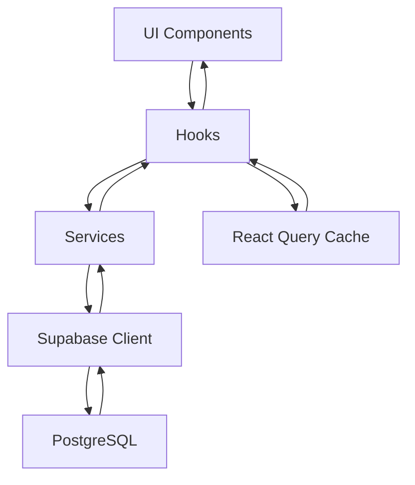

# Arquitetura do Mind Lattice Pro

## 📋 Visão Geral

O Mind Lattice Pro é uma aplicação React para gerenciamento de pacientes e sessões terapêuticas, construída com foco em **Clean Architecture**, **Domain-Driven Design** e **princípios SOLID**.

## 🏗️ Estrutura de Pastas

```
src/
├── shared/                    # Código compartilhado entre features
│   ├── constants/            # Constantes globais e enums
│   ├── schemas/              # Schemas de validação Zod
│   ├── services/             # Serviços base reutilizáveis
│   ├── hooks/                # Hooks compartilhados
│   ├── utils/                # Utilitários comuns
│   └── index.ts              # Barrel exports
│
├── features/                 # Features organizadas por domínio
│   ├── patients/             # Domínio de pacientes
│   │   ├── hooks/           # Hooks específicos do domínio
│   │   ├── services/        # Serviços do domínio
│   │   ├── components/      # Componentes específicos
│   │   └── index.ts         # Barrel exports
│   │
│   ├── appointments/         # Domínio de agendamentos
│   ├── sessions/            # Domínio de sessões
│   └── eemm/               # Domínio EEMM
│
├── components/              # Componentes globais e de UI
│   ├── ui/                 # Componentes base (shadcn/ui)
│   ├── layout/             # Componentes de layout
│   └── common/             # Componentes comuns
│
├── pages/                  # Páginas da aplicação
├── hooks/                  # Hooks globais (legacy - migrar para shared/)
├── lib/                    # Configurações e utilitários
└── integrations/           # Integrações externas (Supabase)
```

## 🧱 Camadas da Arquitetura

### 1. **Camada de Apresentação (UI)**
- **Responsabilidade**: Interfaces de usuário e interações
- **Tecnologias**: React, TypeScript, TailwindCSS, shadcn/ui
- **Localização**: `src/pages/`, `src/components/`

### 2. **Camada de Aplicação (Hooks)**
- **Responsabilidade**: Lógica de aplicação e estado
- **Tecnologias**: React Hooks, TanStack Query
- **Localização**: `src/features/*/hooks/`, `src/shared/hooks/`
- **Características**:
  - Gerenciamento de estado reativo
  - Cache inteligente com React Query
  - Invalidação automática
  - Tratamento de loading/error states

### 3. **Camada de Serviços (Domain Services)**
- **Responsabilidade**: Lógica de negócio e regras de domínio
- **Tecnologias**: TypeScript, Classes
- **Localização**: `src/features/*/services/`, `src/shared/services/`
- **Características**:
  - Padrão Singleton para serviços
  - Herança do BaseService
  - Tratamento centralizado de erros
  - Validação de dados

### 4. **Camada de Infraestrutura (Data Access)**
- **Responsabilidade**: Acesso a dados e APIs externas
- **Tecnologias**: Supabase, PostgreSQL
- **Localização**: `src/integrations/`
- **Características**:
  - Client Supabase configurado
  - Tipos TypeScript gerados
  - RLS (Row Level Security)

## 🔄 Fluxo de Dados



### Exemplo de Fluxo:
1. **Componente** chama hook `usePatients()`
2. **Hook** usa React Query para cache e faz chamada para o serviço
3. **Serviço** `patientsService` valida dados e chama Supabase
4. **Supabase** executa query no PostgreSQL com RLS
5. **Dados** retornam pela mesma cadeia com tratamento de erros
6. **React Query** atualiza cache e componente re-renderiza

## 🏛️ Princípios Aplicados

### **Single Responsibility Principle (SRP)**
- Cada serviço tem uma responsabilidade específica
- Hooks focados em um domínio ou funcionalidade
- Componentes com propósito único

### **Open/Closed Principle (OCP)**
- BaseService extensível para novos domínios
- Hooks reutilizáveis através de configurações
- Componentes configuráveis via props

### **Dependency Inversion Principle (DIP)**
- Hooks dependem de abstrações (interfaces dos serviços)
- Serviços dependem de abstrações (BaseService)
- UI depende de hooks, não diretamente de serviços

### **Don't Repeat Yourself (DRY)**
- Utilidades comuns centralizadas
- BaseService com lógica CRUD reutilizável
- Constantes e schemas compartilhados

## 🔧 Padrões de Design

### **Repository Pattern (via Services)**
```typescript
// Abstração
abstract class BaseService<T> {
  protected abstract tableName: string;
  protected async findMany(...): Promise<ServiceResponse<T[]>> {}
}

// Implementação específica
class PatientsService extends BaseService<Patient> {
  protected tableName = 'patients';
  // Métodos específicos do domínio
}
```

### **Factory Pattern (Hooks)**
```typescript
// Factory de hooks com configurações
export const usePatients = (filters: PatientsSearchInput = {}) => {
  // Lógica configurável baseada nos filtros
};
```

### **Observer Pattern (React Query)**
```typescript
// Invalidação automática entre hooks relacionados
const createPatient = useMutation({
  onSuccess: () => {
    queryClient.invalidateQueries({ queryKey: PATIENTS_QUERY_KEYS.all });
  }
});
```

## 📊 Gerenciamento de Estado

### **Client State**
- **React Query**: Cache de dados do servidor
- **React State**: Estado local de componentes
- **Context**: Estado global (Auth)

### **Server State**
- **React Query**: Sincronização automática
- **Optimistic Updates**: Melhor UX
- **Background Refetching**: Dados sempre atuais

### **Exemplo de Query Keys**
```typescript
export const PATIENTS_QUERY_KEYS = {
  all: ['patients'] as const,
  lists: () => [...PATIENTS_QUERY_KEYS.all, 'list'] as const,
  list: (filters: PatientsSearchInput) => [...PATIENTS_QUERY_KEYS.lists(), filters] as const,
  details: () => [...PATIENTS_QUERY_KEYS.all, 'detail'] as const,
  detail: (id: string) => [...PATIENTS_QUERY_KEYS.details(), id] as const,
};
```

## 🔒 Segurança

### **Row Level Security (RLS)**
```sql
-- Política RLS para tabela patients
CREATE POLICY "Users can view own patients" ON patients
FOR SELECT USING (auth.uid() = therapist_id);
```

### **Validação de Dados**
```typescript
// Schema Zod para validação
export const patientSchema = {
  create: z.object({
    full_name: z.string().min(2).max(100),
    email: z.string().email().optional(),
    // ... outras validações
  })
};
```

### **Sanitização**
- Escape de inputs do usuário
- Validação no cliente e servidor
- Tipos TypeScript rigorosos

## 🚀 Performance

### **React Query Optimizations**
```typescript
const queryClient = new QueryClient({
  defaultOptions: {
    queries: {
      staleTime: 5 * 60 * 1000,  // 5 minutos
      gcTime: 10 * 60 * 1000,    // 10 minutos
      refetchOnWindowFocus: false
    }
  }
});
```

### **Code Splitting**
- Lazy loading de páginas
- Dynamic imports para features
- Tree shaking automático

### **Memoization**
```typescript
// Hooks com useCallback para evitar re-renders
const searchPatients = useCallback((term: string) => {
  // Lógica de busca
}, [patients]);
```

## 🧪 Testes

### **Estratégia de Testes**
- **Unit Tests**: Serviços e utilitários
- **Integration Tests**: Hooks com React Query
- **E2E Tests**: Fluxos críticos de usuário

### **Testando Hooks**
```typescript
import { renderHook } from '@testing-library/react-hooks';
import { usePatients } from '@/features/patients';

test('should load patients', async () => {
  const { result, waitForNextUpdate } = renderHook(() => usePatients());
  
  await waitForNextUpdate();
  
  expect(result.current.patients).toBeDefined();
  expect(result.current.isLoading).toBe(false);
});
```

## 📝 Convenções de Código

### **Nomenclatura**
- **Constantes**: `SCREAMING_SNAKE_CASE`
- **Funções/Variáveis**: `camelCase`
- **Tipos/Interfaces**: `PascalCase`
- **Componentes**: `PascalCase`
- **Arquivos**: `kebab-case` ou `PascalCase`

### **Organização de Imports**
```typescript
// 1. Bibliotecas externas
import React from 'react';
import { useQuery } from '@tanstack/react-query';

// 2. Imports internos
import { useAuth } from '@/shared/hooks/useAuth';
import { patientsService } from '../services/patients.service';

// 3. Imports relativos
import './Component.css';
```

## 🔄 Próximos Passos

1. **Migrar hooks legados** para nova estrutura
2. **Implementar testes** para serviços e hooks
3. **Adicionar mais features** seguindo os padrões estabelecidos
4. **Otimizar performance** com lazy loading
5. **Implementar PWA** para uso offline

---

**Criado em**: 25/10/2025  
**Versão**: 1.0  
**Autor**: Lucas Prac